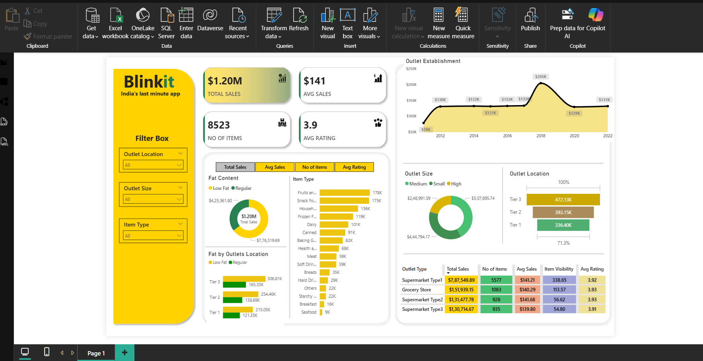
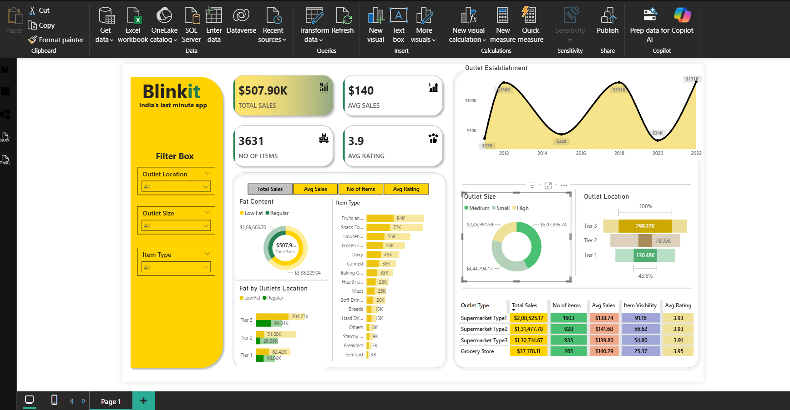
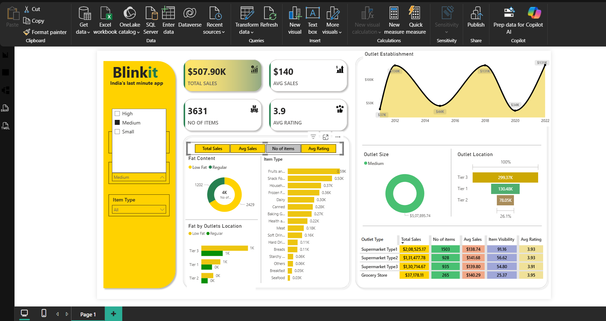
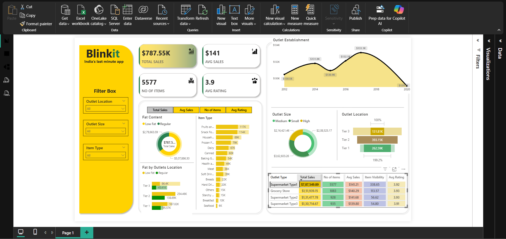

# Blinkit Sales & Outlet Performance Dashboard

A Power BI dashboard analyzing sales performance across BlinkIT (India's last-minute grocery delivery app) outlets, covering 8,523 items and $1.20M in total sales.

## Dashboard Preview



### Filtered Views

| Highlighted by Outlet Size: Medium | Filtered by Outlet Size: Medium |
|---|---|
|  |  |

**Highlighted by Outlet Type: Supermarket Type1**




## Overview

This dashboard provides a complete view of sales performance across outlet types, locations, sizes, and product categories — helping identify top-performing outlets and key revenue drivers.

## Key Metrics (KPIs)

- **Total Sales:** $1.20M
- **Average Sales:** $141
- **No. of Items:** 8,523
- **Average Rating:** 3.9

## Features

- **KPI Cards** — Total Sales, Avg Sales, No. of Items, and Avg Rating built using DAX measures (`SUM`, `AVERAGE`, `COUNTROWS`)
- **Outlet Establishment Trend** — Area/line chart showing sales growth across outlet establishment years (2012–2022)
- **Outlet Size Analysis** — Donut chart breaking down sales by Small, Medium, and High outlet sizes
- **Outlet Location (Tier-wise)** — Bar chart comparing sales across Tier 1, 2, and 3 cities
- **Fat Content & Item Type Analysis** — Donut and bar charts showing sales split by Low Fat/Regular and product categories (Fruits & Vegetables, Snack Foods, Household, etc.)
- **Outlet Type Table** — Matrix with conditional formatting showing Total Sales, No. of Items, Avg Sales, Item Visibility, and Avg Rating per outlet type
- **Dynamic Filter Panel** — Slicers for Outlet Location, Outlet Size, and Item Type
- **Tab-style Switcher** — Bookmark and button navigation to toggle between Total Sales, Avg Sales, No of Items, and Avg Rating views

## Key Insights

- **Tier 3 outlets** generated the highest sales ($472.13K), followed by Tier 2 ($393.15K) and Tier 1 ($336.40K)
- **Supermarket Type1** dominated with $7.87M in total sales and 5,577 items sold
- **Fruits & Vegetables** and **Snack Foods** are the top-selling item categories
- High-size outlets contribute the largest share (42.27%) of total sales

## Tools Used

- **Power BI Desktop** — Dashboard design and visualization
- **Power Query** — Data cleaning and transformation
- **DAX** — Measures for KPIs and calculations

## Dataset

`BlinkIT_Grocery_Data.xlsx` — Contains item-level details (Item Type, Fat Content, Visibility, Weight) and outlet-level details (Outlet Size, Location Type, Establishment Year, Outlet Type) along with Sales and Rating data.

## DAX Measures Used

```dax
Total Sales = SUM('BlinkIT Grocery Data'[Sales])

Avg Sales = AVERAGE('BlinkIT Grocery Data'[Sales])

Total Items Sold = COUNTROWS('BlinkIT Grocery Data')

Avg Rating = AVERAGE('BlinkIT Grocery Data'[Rating])
```

---

**Author:** Piyush Dive
